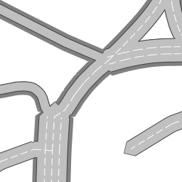

# OpenStreetMap Tiles

A tile renderer for OpenStreetMap that provides the following tile sets:

- Road overlay

## Live slippy map and tile server

A live version is running at https://osm-tiles.james-ross.co.uk/.

## Road overlay

This tile set is an overlay (meaning the tiles are transparent where there is no data) which renders roads (highways) from OpenStreetMap according to their various tags, including:

- `sidewalk=both =left =right`
- `cycleway=lane =opposite_lane`
- `cycleway:left=lane =opposite_lane`
- `cycleway:right=lane =opposite_lane`
- `highway=motorway =trunk =primary =secondary =tertiary =unclassified =residential =service =motorway_link =trunk_link =primary_link =secondary_link =tertiary_link`
- `lanes=*`
- `oneway=yes`
- `parking:lane:both=parallel =diagonal =perpendicular`
- `parking:lane:left=parallel =diagonal =perpendicular`
- `parking:lane:right=parallel =diagonal =perpendicular`
- `layer=*`

### Limitations

- Only zoom levels 16 through 22 are supported.

### Current rendering

## Notes

- Each tile is rendered on-demand, but the underlying data is cached in memory in zoom level 14 chunks.

## To do

- Separation and correction of way end nodes at junctions (to align lanes)
- Calculations for bus, PSV (public service vehicle), other specialised lanes
- Calculations for `placement=*`
- Calculations using turn lane markings
- Calculations for `width`
- Display tapering of road width/lanes
- Display parking lanes/bays
- Display bridges, tunnels
- Display bus, PSV, other specialised lanes
- Display turn lane markings (left/right turn arrows, etc.)
